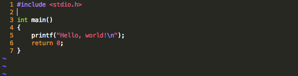
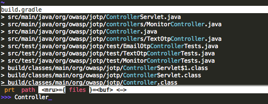

# Give Vim a Sublime Facelift

<!-- 6/28/2014 -->

I've started to use [Sublime Text](http://www.sublimetext.com) at work and I have to admit: I like it.  It's quick, extensible, and has a number of features that make editing code a snap (everyones' favorite on the Internet appears to be Ctrl-D, but I personally can't get enough of the "Fuzzy Find" feature.  It even supports "Vintage" mode - a feature that allows a subset of Vim commands.  That said, I still find myself repeatedly returning to Vim for a few reasons:

* **It's Expensive** - As much as I like Sublime Text, it's not cheap.  As of this writing, a single user license will run you $70.
* **Command Prompt Access** - I find myself popping out to the command prompt...a lot.  Maybe I've been drinking too much of the "Command Line Kool-Aid", but there's something about constantly moving a mouse from my text editor to a separate command prompt window that really annoys me.  I'm not knocking Sublime's built-in build system integration - it's actually pretty awesome.  However, not everything can (or should) be mapped to a text editor's "Build" hotkey.
* **Vintage Mode Isn't Vim** - Again, this isn't really something that Sublime Text got wrong.  In truth, it's about as good as it could be.  However, because Vim is designed to operate in terminal environments, and because Sublime Text operates in a windowed environment with features inherent to that ecosystem, there's some overlap between the two worlds' keyboard commands, and only a subset of the Vim feature-set can realistically be supported.  I usually get confused and end up shooting myself in the foot when I try to use it, so I generally turn it off.

In its default state, Vim is pretty hideous and hard to use (no syntax highlighting, no automatic indenting, etc, etc).  With a few tweaks, however, it can actually be quite beautiful and even reminiscient of Sublime Text.

## 1. Install ctrlp.vim

This nifty little plugin adds a "fuzzy find" feature to your Vim install.  The download and installation instructions can be found, [here](http://kien.github.io/ctrlp.vim).  While you can choose where you would like to extract the plugin files on your own computer, this tutorial assumes that they are located in, **~/.vim/bundle**.

## 2. Update .vimrc

Add the following lines to your **.vimrc** file.  Note that this subset doesn't include configuration for other plugins and features, or account for your own personal preferences (eg. I like my tab space to be set to 4).

	set ai
	set ts=4
	set number
	set hlsearch
	set runtimepath^=~/.vim/bundle/ctrlp.vim
	set shiftwidth=4
	set tabstop=4
	filetype plugin indent on
	syntax on
	
## 3. Update the Terminal Theme (Mac OS X only)

1. Download the [Monokai.terminal](https://github.com/stephenway/monokai.terminal) color scheme.
2. Double-click on the Monokai.terminal file.  An OS X terminal window will be opened.
3. Under **Terminal** > **Preferences**, select the *Monokai* profile, and set it as the default.

If all goes well, source files opened with Vim from the terminal should look very Sublime Text-esque:

And with the **ctrlp** plugin, finding files in and under your current directory is a snap:

