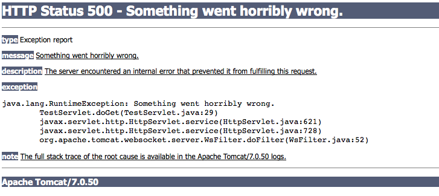
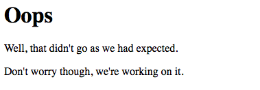
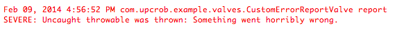

# Writing a Custom Error Report Valve for Tomcat

<!-- 2/15/2014 -->

If you've developed (or used a web application running) on a Java-based server before, you've probably seen something like this:

This can happen for a number of reasons ranging from a misconfigured server to a bug in an application.  While we developers like to think we can offer a "bug-free guarantee", this frequently isn't the case.  Usually, these error pages contain harmless information that's just a cryptic annoyance to end users.  Sometimes, however, the stacktraces contained in them can leak information that can be used to by attackers to pin-point weaknesses in applications and infrastructure.  For this reason, it's useful to be able to override the default error page.  

In Tomcat, this can be done by creating a custom **Valve**.  In a nutshell, valves act as universal filters for all applications on the server.  In this short tutorial, I'll describe how to override Tomcat's default **ErrorReportValve**, the valve responsible for creating the output shown above, to display something a little more friendly (though not necessarily pretty.)

## 1. Write The Valve Class

The first thing we'll need to do is write our replacement valve.  While you can do this entirely from scratch, it's easiest just to override the **report()** method in built-in **ErrorReportValve** class:

	package com.upcrob.example.valves;

	import java.io.BufferedWriter;
	import java.io.IOException;
	import java.io.OutputStreamWriter;
	import java.util.logging.Logger;
	
	import org.apache.catalina.connector.Request;
	import org.apache.catalina.connector.Response;
	import org.apache.catalina.valves.ErrorReportValve;
	
	public class CustomErrorReportValve extends ErrorReportValve {
	
		// Create a simple logger
		Logger log = Logger.getLogger(CustomErrorReportValve.class.getName());
		
		@Override
		protected void report(Request request, Response response, Throwable t) {
			try {
				// Write a more friendly, less technical message to the user
				BufferedWriter out = new BufferedWriter(new OutputStreamWriter(response.getOutputStream()));
				out.write("<html><head><title>Oops</title><body>");
				out.write("<h1>Oops</h1>");
				out.write("
Well, that didn't go as we had expected.
");
				out.write("
Don't worry though, we're working on it.
");
				out.write("</body></html>");
				out.close();
				
				// Log the error with your favorite logging framework...
				log.severe("Uncaught throwable was thrown: " + t.getMessage());
			} catch (IOException e) {
				e.printStackTrace();
			}
		}
	}

By overriding **report()**, we can modify what Tomcat writes out to the end user's browser.  In this case, we'll just write out a simple "oops" page.  This can be as simple or as complex as you would like.

While the stacktrace has been concealed from the end user, it's helpful for the developer to know that it *did*, in fact, happen.  For this reason, we log the message from the **Throwable** that was caught to an output log.  Again, this can be as simple or complex as you wish to make it.

## 2. Deploy The Custom Valve

Once we've written the **CustomErrorReportValve**, it will need to be deployed to the server.  We simply compile the above class and package it into a JAR file.  Since valves are loaded at the server level, the JAR containing the compiled class file will need to be placed in the instance's **lib** directory.

## 3. Configure The Server To Use The New Valve

After the CustomErrorReportValve JAR has been placed on the server, Tomcat will need to be told to use it instead of the default class.  This can be done by updating the **<Host>** element in Tomcat's **server.xml** file:

	<Host errorReportValveClass="com.upcrob.example.valves.CustomErrorReportValve" . . . />
	
IMPORTANT: Because the changes in steps 2 and 3 occur at the server level, Tomcat will need to be restarted whenever a change is made to the valve JAR or **server.xml**.
	
## 4. Watch the Magic Happen

Start the server and navigate to an app that throws (but doesn't catch) a **RuntimeException**.  Instead of seeing the error at the beginning of this article in the browser, the user should see something like this:

Finally, something like this should show up in the logs:

